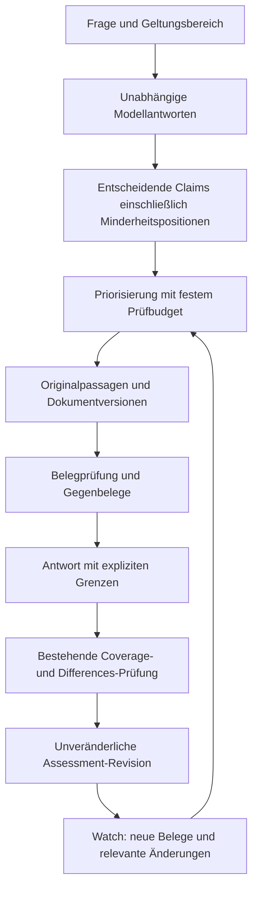

# consens.io: Evidenzbasierte Consensus Engine

## Empfehlung

**Die wertvollste anspruchsvolle Erweiterung ist eine Consensus Engine, die entscheidende Aussagen anhand konkreter Quellenpassagen prüft und ihren Evidenzstand über Zeit versioniert.** Sie sollte auf der bestehenden Synthese, dem Coverage-Judge und dem Claim Ledger aufbauen. Ihr Ergebnis beantwortet drei getrennte Fragen: Welche Modelle stimmen zu? Welche Quellen tragen die Aussage tatsächlich? Was hat sich seit der letzten Prüfung verändert?

Der erwartete Vorteil liegt in nachprüfbarer Antwortqualität und einer wachsenden Historie von belegten, widerlegten und weiterhin offenen Aussagen. Besonders geeignet ist zunächst die wiederkehrende Bewertung von AI-Produkten und technischen Fähigkeiten: öffentliche Dokumentation, Releases, Benchmarks und Herstellerbehauptungen passen zum vorhandenen Topic- und Publisher-System. Die Überlegenheit gegenüber heutigen Research-Produkten ist eine **zu prüfende Produkthypothese**, keine bereits belegte Marktposition.

Vier Befunde begründen diese Empfehlung:

- Die bestehende Engine prüft Modellübereinstimmung differenziert, verfügt im untersuchten Kernpfad jedoch über keine eigenständige Prüfung von Aussage gegen abgerufene Originalpassage.
- Im gespeicherten Benchmark erreichen Consensus und Synthesemodell allein beide **286/314** richtige Antworten. Die Aggregation verbessert sechs Fälle und verschlechtert sechs andere gegenüber dieser Baseline.
- In **15/314** Fällen enthält mindestens eine Modellantwort die richtige Lösung, die Synthese entscheidet sich trotzdem falsch. In **9/246 einstimmigen Fällen** stimmen alle sechs Modelle derselben falschen Antwort zu.
- Vergleich, Synthese und zitierte Research-Berichte sind bereits öffentlich verfügbare Produktmuster. Der anspruchsvolle nächste Schritt ist eine belastbare Verbindung zwischen Aussage, Beleg, Entscheidung und zeitlicher Änderung. [B2](C:/Users/maxlp/OneDrive/Dokumente/typeonai/artifacts/research/consensio-2026-09-08/analyze_benchmark.py) [K2](C:/Users/maxlp/OneDrive/Dokumente/typeonai/app/services/llm/consensus_engine.py:312) [R7](https://www.perplexity.ai/changelog/what-we-shipped---february-6th-2026)

**Investitionsentscheidung:** Zuerst einen eng begrenzten Prototyp und eine unabhängige Qualitätsmessung finanzieren. Bei messbarem Zusatznutzen folgen ein produktiver Modus für Topics und Watches sowie die Integration in den Chat. Die technische Planung für diese Stufen liegt bei ungefähr **12–18 Personenwochen**; das ist eine Schätzung für erfahrene Umsetzung und fachliche Evaluation, kein Liefertermin.

## 1. Ausgangslage und Belastbarkeit

Die Analyse bezieht sich auf den lokalen Arbeitsstand vom 8. September 2026. Sie umfasst Architekturkarte, produktive Synthese- und Judge-Pfade, Quellenverarbeitung, Resolve, Topic- und Watch-Abläufe, Claim-Identität, Persistenzverträge sowie den Benchmark-Runner und seine vorhandenen Daten. Der Arbeitsbaum enthielt bereits Änderungen. Produktionsbetrieb, echte Nutzersitzungen und aktuelle Firestore-Konfiguration wurden nicht ausgelesen; Aussagen über Adoption, Umsatz, tatsächliche Kosten und aktuelle Fehlerhäufigkeiten wären deshalb nicht belastbar.

Die stärkste zusätzliche empirische Grundlage ist eine neue Auswertung der **2.512 gespeicherten Benchmarkzellen** aus `pooled_v1`. Sie enthält 314 Fragen mit je sechs Modellantworten, einer Synthese und einem separat befragten Synthesemodell. Alle Zellen sind eindeutig, und die neu berechneten Korrektheitszahlen stimmen mit dem gespeicherten Ergebnisbericht überein. Die Modellantworten wurden für diese Analyse nicht neu erzeugt. [B1](C:/Users/maxlp/OneDrive/Dokumente/typeonai/data/benchmark/runs/pooled_v1/manifest.json) [B2](C:/Users/maxlp/OneDrive/Dokumente/typeonai/artifacts/research/consensio-2026-09-08/analyze_benchmark.py)

Die vorhandenen Tests für Coverage, Differences-Schema, Claim Ledger, Drift, Resolve, Citations und Benchmark-Auswertung wurden ausgeführt: **167 bestanden**. Diese Tests belegen das implementierte Verhalten der ausgewählten Komponenten. Sie ersetzen keine faktische Bewertung neuer LLM-Ausgaben.

Im Bericht bedeuten **Befund** eine direkt belegte Eigenschaft des Codes oder der Daten, **Interpretation** eine daraus abgeleitete Bewertung und **Vorschlag** eine noch zu implementierende Lösung. Alle nachfolgenden Zielwerte und Aufwände sind Planungsannahmen.

## 2. Das vorhandene Fundament

consens.io besitzt bereits deutlich mehr als parallele Modellabfragen. Eine neutrale Serverpipeline verbindet Providerantworten, Synthese, Differences und Agreement. Der Syntheseprompt anonymisiert und mischt die Antworten; ein pauschaler Vorschlag, erst einmal Modellnamen vor dem Judge zu verbergen, würde den aktuellen Stand verfehlen. [K1](C:/Users/maxlp/OneDrive/Dokumente/typeonai/app/services/consensus_pipeline.py:49) [K2](C:/Users/maxlp/OneDrive/Dokumente/typeonai/app/services/llm/consensus_engine.py:312)

Der Coverage-Judge verlangt Satz-IDs und eine explizite Haltung jedes Modells. Fehlende Sätze werden gezielt nachgefordert. Die Zustände `supports`, `contradicts`, `not_addressed` und `unclear` verhindern, dass eine nicht behandelte Aussage automatisch als Zustimmung zählt. Der Score berücksichtigt dünne Abdeckung, widersprüchliche Aussagen und Modellanzahl. Diese Differenzierungen sollten erhalten bleiben. [K3](C:/Users/maxlp/OneDrive/Dokumente/typeonai/app/services/llm/coverage_judge.py:37) [K4](C:/Users/maxlp/OneDrive/Dokumente/typeonai/app/services/llm/consensus_scoring.py:23)

Auch Claim-Identität ist bereits vorhanden. Topics versehen Aussagen über einen Identity-Judge mit wiederverwendbaren Schlüsseln; das Ledger bevorzugt diese Schlüssel und verwendet lexikalischen Abgleich als Fallback. Ein neuer Wissensgraph wäre folglich keine Einführung von Claim-Tracking, sondern eine Erweiterung um **Originalbelege, semantischen Geltungsbereich und verifizierte Zustandsänderungen**. [K7](C:/Users/maxlp/OneDrive/Dokumente/typeonai/app/services/claim_ledger.py:170) [K8](C:/Users/maxlp/OneDrive/Dokumente/typeonai/app/services/topic_pipeline.py:20)

Watches und Topics liefern bereits die geeigneten Produktflächen: wiederholte Läufe, historische Snapshots, Änderungsbewertung und Benachrichtigungen. Persistente Idempotenz, Leases, Account-Löschbarrieren und serverseitige Finalisierung bilden wesentliche technische Voraussetzungen. Diese Komponenten senken den Integrationsaufwand, lösen aber noch nicht die inhaltliche Evidenzprüfung. [K9](C:/Users/maxlp/OneDrive/Dokumente/typeonai/app/services/drift_signal.py:1) [K10](C:/Users/maxlp/OneDrive/Dokumente/typeonai/app/services/api_consensus_runner.py:53) [K11](C:/Users/maxlp/OneDrive/Dokumente/typeonai/docs/codebase-map.md:3449) [K12](C:/Users/maxlp/OneDrive/Dokumente/typeonai/app/api/routers/chat.py:1240)

## 3. Die entscheidende Qualitätslücke

### 3.1 Modellstützung und Quellenstützung sind verschiedene Messgrößen

`compute_agreement_score` berechnet Zustimmung aus den Listen `agree` und `dissent`, zieht gewichtete Widerspruchspenalties ab und begrenzt den Wert nach Coverage und Modellanzahl. Die Funktion bekommt keine Originaldokumente und keine Labels für tatsächliche Korrektheit. Sie ist daher ein Agreement-Maß, keine kalibrierte Wahrscheinlichkeit, dass eine Antwort stimmt. Das README erkennt diese Unterscheidung ausdrücklich an. [K4](C:/Users/maxlp/OneDrive/Dokumente/typeonai/app/services/llm/consensus_scoring.py:23) [K13](C:/Users/maxlp/OneDrive/Dokumente/typeonai/README.md:88)

Ein isolierter Aufruf des unveränderten Scorers ergibt bei einer synthetischen, einstimmig gestützten Aussage ohne Differences **100/100**. Das ist für die definierte Aufgabe korrekt. Ob die Aussage falsch ist oder sechs Modelle denselben fehlerhaften Ursprung wiederholen, kann diese Funktion anhand ihrer Eingaben nicht unterscheiden. Dieser Versuch demonstriert die Messgrenze; er ist keine Messung realer falscher 100-Punkte-Antworten. [B2](C:/Users/maxlp/OneDrive/Dokumente/typeonai/artifacts/research/consensio-2026-09-08/analyze_benchmark.py)

Die interne Bezeichnung `evidence_coverage` beschreibt hier vor allem die Abdeckung durch analysierte Modellantworten. Sie sollte in einer neuen Quellenprüfung nicht still eine zweite Bedeutung erhalten. Modellabdeckung, Belegabdeckung und empirische Zuverlässigkeit benötigen getrennte Felder und verständliche UI-Texte.

### 3.2 Quellen sind vorhanden, ihre Aussagekraft wird nicht eigenständig geprüft

Der Providerparser kann URL-Zitate einschließlich eines kurzen Inhaltsausschnitts aufnehmen. In `_format_sources_for_prompt` werden für die Synthese jedoch nur ID, Titel und URL als kompakte Provenienz aufbereitet. `sanitize_sources` persistiert ID, Titel, URL und Provider; ein überprüfbarer Originalausschnitt oder Dokumenthash gehört nicht zu dieser Projektion. Bei automatisch erzeugter Topic-Evidence setzt `evidence_from_sources` `published_at` und `excerpt` sogar ausdrücklich leer. [K2](C:/Users/maxlp/OneDrive/Dokumente/typeonai/app/services/llm/consensus_engine.py:312) [K5](C:/Users/maxlp/OneDrive/Dokumente/typeonai/app/services/llm/citations.py:306) [K6](C:/Users/maxlp/OneDrive/Dokumente/typeonai/app/services/topic_runner.py:64)

Damit kann die Synthese durchaus Quellenhinweise und zitierte Informationen aus Modellantworten berücksichtigen. **Was fehlt, ist ein kontrollierter, separater Ablauf, der die Originalpassage abruft und ihre Tragfähigkeit für einen konkreten Claim bewertet.** Ein plausibler Link ist noch kein Beleg für die danebenstehende Aussage.

Die vorhandene Zitatverifikation ist wertvoll: `_verify_claims` und `_verify_differences_data` prüfen, ob ein Zitat tatsächlich in einer Modellantwort vorkommt. Das verhindert erfundene Modellzitate. Es prüft weder den Wahrheitsgehalt dieser Antwort noch die Übereinstimmung mit einer externen Originalquelle. [K2](C:/Users/maxlp/OneDrive/Dokumente/typeonai/app/services/llm/consensus_engine.py:312)

### 3.3 Resolve produziert eine Neubewertung, keine neue Beobachtung

Die Resolve-Runde konfrontiert günstige Standardmodelle der beteiligten Familien mit Gegenpositionen und fordert `maintain` oder `revise`. Im untersuchten Ablauf gibt es keinen gesonderten Quellenabruf. Das aggregierte Ergebnis `resolved` entsteht, wenn mindestens eine gültige Antwort revidiert und mindestens eine ihre Position hält. Dieser Zustand bedeutet eine Bewegung der Modellpositionen, keine unabhängig bewiesene Lösung des Sachverhalts. [K14](C:/Users/maxlp/OneDrive/Dokumente/typeonai/app/services/llm/resolve_engine.py:101)

Eine stärkere Version von Resolve sollte deshalb eine **offene Sachfrage mit überprüfbaren Belegen** bearbeiten. Sie darf einen unbelegten Gruppenkonsens nicht allein wegen erfolgreicher gegenseitiger Überzeugung als faktisch geklärt darstellen.

### 3.4 Historie zeigt heute vor allem Änderungen der Antworten

`query_consensus_change` vergleicht alten und neuen Consensus-Text. `drift_signal` dämpft bereits bekannte Probleme wie paraphrasierte Aussagen und Sprünge zwischen Score-Caps. Das Ledger verbindet Positionen über mehrere Läufe. Diese Mechanismen sind sinnvoll, können aber ohne Dokumentversionen nicht robust unterscheiden, ob sich die Welt, eine Quelle, das Modell oder nur dessen Interpretation verändert hat. [K2](C:/Users/maxlp/OneDrive/Dokumente/typeonai/app/services/llm/consensus_engine.py:312) [K7](C:/Users/maxlp/OneDrive/Dokumente/typeonai/app/services/claim_ledger.py:170) [K9](C:/Users/maxlp/OneDrive/Dokumente/typeonai/app/services/drift_signal.py:1)

Genau diese Unterscheidung ist für wiederkehrende Entscheidungen wertvoll: Ein neues Release-Dokument ist ein anderer Anlass als ein anderer Judge oder eine unverändert belegte Aussage mit neuer Formulierung.

## 4. Was die eigenen Benchmarkdaten tatsächlich zeigen

### 4.1 Ergebnis gegen starke Baselines

| System im gespeicherten Lauf | Richtig / 314 | Accuracy |
|---|---:|---:|
| Consensus | 286 | 91,08 % |
| Synthesemodell allein | 286 | 91,08 % |
| Anthropic-Kandidat | 285 | 90,76 % |
| OpenAI-Kandidat | 284 | 90,45 % |
| Mehrheitswahl laut Ergebnisbericht | 282 | 89,81 % |
| Mindestens ein Kandidat richtig, hypothetische Auswahl mit Kenntnis der Lösung | 301 | 95,86 % |

Quelle: erneute Aggregation von `calls.jsonl`, Abgleich mit `results.json`; Mehrheitswahl aus dem gespeicherten Ergebnisbericht. Die letzte Zeile ist ein **Oracle-Vergleich**, kein erreichter Systemwert und keine obere Grenze für Verfahren, die zusätzliche Informationen gewinnen. [B1](C:/Users/maxlp/OneDrive/Dokumente/typeonai/data/benchmark/runs/pooled_v1/manifest.json) [B2](C:/Users/maxlp/OneDrive/Dokumente/typeonai/artifacts/research/consensio-2026-09-08/analyze_benchmark.py)

Gegen das separat getestete Synthesemodell rettet die Aggregation sechs Fragen und verliert sechs andere. Es handelt sich nicht um kopierte Antworttexte: Kein Consensus-Text ist mit seinem zugehörigen Alone-Text identisch. Gegen Anthropic stehen neun zusätzliche richtige Antworten acht zusätzlich falschen gegenüber. Ein exakter zweiseitiger McNemar-Test auf den gepaarten Korrektheitslabels ergibt in beiden Vergleichen **p = 1,0**. Das belegt keinen Qualitätsvorsprung; es beweist auch keine allgemeine Gleichwertigkeit. [B2](C:/Users/maxlp/OneDrive/Dokumente/typeonai/artifacts/research/consensio-2026-09-08/analyze_benchmark.py)

Die öffentliche Benchmarkvorlage zeigt den Alone-Vergleich in ihren Chartreihen nicht. Für eine professionelle Evaluationsseite wäre diese vorhandene Baseline besonders aussagekräftig. Außerdem ist die dortige Regel „überlappende 95%-Intervalle bedeuten nicht signifikant“ statistisch zu pauschal: Bei denselben Fragen ist ein gepaarter Vergleich maßgeblich. Für diesen konkreten Datensatz ergibt die gepaarte Auswertung ebenfalls keinen nachgewiesenen Vorteil. [K15](C:/Users/maxlp/OneDrive/Dokumente/typeonai/templates/benchmark.html:183) [B2](C:/Users/maxlp/OneDrive/Dokumente/typeonai/artifacts/research/consensio-2026-09-08/analyze_benchmark.py)

### 4.2 Zwei unterschiedliche Fehlertypen

**Verlorene richtige Kandidaten:** In 15 Fällen ist mindestens ein Kandidat richtig, der Consensus aber falsch. Hier besteht eine Chance für bessere Auswahl, Gegenprüfung und Erhaltung korrekter Minderheitspositionen. Beispiele sind die Frage-IDs 1062, 4825, 6471 und 9558; alle 15 IDs sind im Analyseartefakt hinterlegt.

**Gemeinsame Fehler:** Bei 13 Fragen sind alle sechs Kandidaten falsch. Neun davon sind einstimmig falsch; das sind **3,66 % der 246 einstimmigen Fragen**. Der Consensus korrigiert in diesem gespeicherten Lauf keinen der 13 gemeinsamen Fehler. Zusätzliche Beobachtungen, belastbare Quellen oder ausführbare Prüfungen sind hier besonders plausibel, weil bloße Auswahl aus den vorhandenen Antworten keine richtige Lösung liefern kann. [B2](C:/Users/maxlp/OneDrive/Dokumente/typeonai/artifacts/research/consensio-2026-09-08/analyze_benchmark.py)

Daraus folgt eine konkrete Designregel: **Verifikation darf nicht ausschließlich bei sichtbarem Dissens starten.** Sonst bleiben genau die gemeinsamen, überzeugend vorgetragenen Fehler außerhalb der Prüfung. Entscheidungsrelevanz, Aktualität und fehlende Originalbelege müssen ebenfalls Auslöser sein.

### 4.3 Grenzen dieser Daten

Der Lauf stammt vom **28.–29. Juni 2026**, verwendet den damaligen `names`-Prompt und bündelt drei Stichprobenstrategien: kategorienbalanciert, nach Uneinigkeit angereichert und zufällig. Die aktuelle Synthese anonymisiert und mischt die Modellantworten. Die Ergebnisse sind deshalb ein historischer Diagnosebefund und keine Schätzung der heutigen Produktionsqualität oder einer repräsentativen Nutzungsverteilung. [B1](C:/Users/maxlp/OneDrive/Dokumente/typeonai/data/benchmark/runs/pooled_v1/manifest.json) [K2](C:/Users/maxlp/OneDrive/Dokumente/typeonai/app/services/llm/consensus_engine.py:312)

Es handelt sich zudem um Multiple-Choice-Fragen ohne Websuche. Der Runner ruft in diesem Benchmark keine Differences- oder Coverage-Prüfung auf. Die neun einstimmigen Fehler haben daher **keinen gemessenen produktiven Agreement-Score**. Insbesondere wäre die Behauptung „neun nachgewiesene 100-Punkte-Halluzinationen“ falsch. [K16](C:/Users/maxlp/OneDrive/Dokumente/typeonai/benchmark/runner.py:363)

Auch eine aus den Dateien berechnete Kostenrelation wäre irreführend: Die Consensus-Kostenschätzung setzt für den Input sechs Kandidaten-Output-Caps an, während andere Zellen Token-Usage verwenden. Die gespeicherten Beträge eignen sich nicht als sauberer Vergleich tatsächlich abgerechneter Systemkosten. Für künftige Experimente müssen alle Stufen reale Nutzungsmetadaten erfassen. [K16](C:/Users/maxlp/OneDrive/Dokumente/typeonai/benchmark/runner.py:363)

## 5. Forschung und Wettbewerb

### 5.1 Verschiedene Modelle garantieren keine unabhängigen Fehler

Kim et al. untersuchen über 350 Modelle und finden erhebliche gemeinsame Fehler. In einem der untersuchten Leaderboard-Datensätze wählen Modellpaare bei beiderseitigem Fehler durchschnittlich ungefähr 60 % der Zeit dieselbe falsche Antwort. Auch leistungsfähige Modelle unterschiedlicher Anbieter zeigen Korrelation. Die Zahl beschreibt deren Untersuchungssetting, nicht die aktuellen consens.io-Modelle. Der Befund unterstützt jedoch die Entscheidung, Anbieterdiversität nicht mit unabhängiger Bestätigung gleichzusetzen. [R1](https://arxiv.org/html/2506.07962v1)

### 5.2 Zusätzliche Debattenrunden sind keine sichere Qualitätsstrategie

Choi et al. trennen Mehrheitswahl von Kommunikation zwischen Modellen und finden in ihren Experimenten, dass Voting einen großen Teil des Nutzens erklärt. Ihre theoretische Analyse beruht auf Modellannahmen, insbesondere homogenen Agenten, und ist kein Unmöglichkeitsbeweis für heterogene consens.io-Synthese. Kaesberg et al. berichten zudem unterschiedliche Vorteile von Entscheidungsprotokollen je nach Wissens- oder Reasoning-Aufgabe. Zusammen sprechen die Arbeiten für aufgabenspezifische Experimente und starke Baselines, nicht für pauschal immer längere Debatten. [R2](https://arxiv.org/html/2508.17536v1) [R3](https://aclanthology.org/2025.findings-acl.606/)

### 5.3 Atomare Fakten und abgerufene Belege sind ein tragfähiger Ansatz

FActScore zerlegt längere Antworten in atomare Fakten und misst, welcher Anteil durch eine Wissensquelle unterstützt wird. SAFE verbindet atomare Aussagen mit gezielter Suche und einer Belegprüfung. Diese Arbeiten begründen die technische Richtung einer eigenständigen Verifikation, belegen aber nicht, dass der konkrete vorgeschlagene consens.io-Modus bereits besser ist. [R4](https://aclanthology.org/2023.emnlp-main.741/) [R5](https://arxiv.org/html/2403.18802v1)

SAFE benennt selbst Fehlerquellen bei Zerlegung, Suchanfragen und Bewertung. Nicht gefundene Belege sind keine Widerlegung; verfügbare Suchergebnisse sind keine vollständige Abbildung der Wahrheit. Daher sollten produktive Labels „durch diese Belege gestützt“, „widersprüchlich“ und „offen“ ausdrücken, statt eine universelle Wahrheitsgarantie zu suggerieren. [R5](https://arxiv.org/html/2403.18802v1)

### 5.4 Der reine Modellvergleich ist bereits leicht reproduzierbar

Karpathys öffentliches LLM Council kombiniert parallele Antworten, anonymisierte Bewertungen und eine abschließende Synthese. Perplexity dokumentiert mit Model Council ebenfalls drei parallele Modelle, eine separate Synthese sowie die Darstellung von Übereinstimmung und Unterschieden. Damit reicht ein weiterer Vergleichsmodus allein als langfristige Differenzierung kaum aus. Dies ist eine strategische Schlussfolgerung aus öffentlich dokumentierten Funktionen, keine Aussage über deren gesamte interne Architektur. [R6](https://github.com/karpathy/llm-council) [R7](https://www.perplexity.ai/changelog/what-we-shipped---february-6th-2026)

Elicit zeigt bereits Zitate mit konkreten Textpassagen und bewertet unter anderem die Unterstützung wichtiger Claims. „Quellen am Satz anzeigen“ wäre daher ebenfalls keine alleinige Alleinstellung. Die interessante Differenzierungshypothese für consens.io ist die Kombination aus **heterogenen Positionen, nachvollziehbarer Belegprüfung, zeitlicher Claim-Historie und entscheidungsbezogenen Änderungsalarmen**. Ein vollständiger Ausschluss vergleichbarer Angebote lässt sich aus dieser begrenzten Wettbewerbsprüfung nicht ableiten. [R8](https://elicit.com/blog/elicit-reports-eval)

## 6. Zielverhalten im Produkt

Ein illustratives Beispiel: Ein Team fragt, ob Produkt X bereits für seinen europäischen Produktivbetrieb geeignet ist. Fünf Modelle lesen eine neue Ankündigung positiv; ein Modell verweist auf eine Preview-Beschränkung. Die Synthese kann aus den Antworten eine plausible Empfehlung bilden, ohne dass der Unterschied zwischen Ankündigung, Dokumentation und tatsächlich freigeschaltetem Funktionsumfang unabhängig geprüft wurde.

Die erweiterte Engine identifiziert drei getrennte Aussagen: Die Funktion wurde angekündigt; sie ist in der relevanten Region verfügbar; sie ist für die betreffende Betriebsart freigegeben. Sie liest die passenden Originalpassagen, prüft Datum und Geltungsbereich und erkennt, wenn mehrere Artikel lediglich dieselbe Herstellerankündigung wiedergeben. Falls nur die erste Aussage belegt ist, darf daraus kein uneingeschränktes „produktionsreif“ werden.

Die Oberfläche zeigt weiterhin eine gut lesbare Antwort. Am entscheidenden Satz öffnet sich eine Belegansicht mit Originalpassage, Dokumentversion und kurzer Einordnung. Modellzustimmung bleibt separat sichtbar. Eine spätere Dokumentationsänderung kann dann einen Watch-Hinweis auslösen: „Die bisherige Preview-Beschränkung wurde in der Dokumentation aufgehoben; die Empfehlung wurde deshalb neu bewertet.“ Dieses Beispiel beschreibt gewünschtes Verhalten, keinen tatsächlich beobachteten Nutzerlauf.

Für Schreibaufgaben wie die vorhandene Launch-Nachrichten-Demo wäre derselbe Ablauf oft unpassend. Tonalität, Höflichkeit und Kommunikationsziele lassen sich nicht durch Webquellen zu einer einzigen objektiven Wahrheit verdichten. Der Modus muss factual Claims von Präferenzen, Empfehlungen und kreativen Aufgaben unterscheiden und nur passende Bestandteile verifizieren.

## 7. Technischer Entwurf

Der vorgeschlagene Prüfmodus verbindet die vorhandenen Bausteine über versionierte Ergebnisse:



Der Rückweg beschreibt spätere geplante Prüfungen, keine unbegrenzte Schleife innerhalb einer einzelnen Anfrage. Vor Veröffentlichung wird zusätzlich geprüft, ob die finale Antwort mit den verifizierten Claims übereinstimmt.

### 7.1 Eine gemeinsame Repräsentation von Claims und Belegen

Das logische Datenmodell enthält fünf Bausteine. „Graph“ bezeichnet zunächst die Beziehungen zwischen ihnen; eine zusätzliche Graphdatenbank ist für die erste Umsetzung nicht erforderlich.

| Baustein | Inhalt | Entscheidend für |
|---|---|---|
| `Claim` | stabile Identität, Aussage, Typ, Entität, Geltungsbereich, Zeitpunkt, notwendige Annahmen | Paraphrasen verbinden, verschiedene Behauptungen trennen |
| `ClaimOccurrence` | Run, Antwortrevision, ursprünglicher Satz/Zelle, exakter Textanker, Claim-ID | bestehende Inline-Marker und spätere Textrevisionen |
| `EvidenceDocumentVersion` | Original-/kanonische URL, Abrufzeit, Veröffentlichungszeit falls bekannt, Inhalts- und Parserhash, Zugriffsstatus | Belege später nachvollziehen |
| `EvidenceEdge` | Claim-ID, Dokumentversion, Passage, Beziehung `supports/contradicts/insufficient`, Bewertungsmetadaten | nachvollziehbare Aussage-Quellen-Verbindung |
| `AssessmentRevision` | Evidenzstatus, Abdeckung, offene Punkte, verwendete Modelle/Prompts/Policy, Änderung zur Vorversion | Prüfung, Historie, Replay und Benachrichtigung |

Eine `sentence_id` ist nur innerhalb ihrer Antwortrevision eindeutig. Die bestehende Absatz-/Satzverankerung bleibt deshalb als Anzeigevertrag erhalten. Ein Satz kann mehrere atomare Claims enthalten; umgekehrt kann dieselbe Aussage an mehreren Stellen erscheinen. Eine pauschale Ersetzung des Satzindex durch LLM-generierte Formulierungen würde die funktionierende Markierung beschädigen. [K2](C:/Users/maxlp/OneDrive/Dokumente/typeonai/app/services/llm/consensus_engine.py:312) [K3](C:/Users/maxlp/OneDrive/Dokumente/typeonai/app/services/llm/coverage_judge.py:37)

Die Claim-Identität muss Geltungsbereich und Zeit berücksichtigen. „Feature vorhanden“, „Feature allgemein verfügbar“ und „Feature in Tarif A und Region B verfügbar“ dürfen nicht zusammenfallen. Für zeitliche Historie braucht es außerdem eine fachliche Themenidentität und darunter versionierte Aussagen: Eine echte Änderung darf weder als bloße Paraphrase verschwinden noch als völlig unverbundener neuer Claim entstehen. Der vorhandene Identity-Judge liefert Kandidatenzuordnungen; explizite Qualifier-Prüfungen und nachvollziehbare Split-/Merge-Ereignisse ergänzen ihn. [K7](C:/Users/maxlp/OneDrive/Dokumente/typeonai/app/services/claim_ledger.py:170) [K8](C:/Users/maxlp/OneDrive/Dokumente/typeonai/app/services/topic_pipeline.py:20)

### 7.2 Claim-Inventar vor der abschließenden Entscheidung

Der heutige Coverage-Judge bewertet Sätze der bereits erzeugten Synthese. Für eine verbesserte Entscheidung reicht das allein nicht: Eine wichtige Minderheitsposition, die im Consensus fehlt, kann in dessen Satzinventar nicht auftauchen. Der neue Modus erstellt deshalb zusätzlich ein begrenztes Inventar entscheidungsrelevanter Behauptungen aus **Frage und Kandidatenantworten**.

Zu jedem Claim werden Positionen, ursprüngliche Textstellen, vorhandene Zitate und Bedeutung für die Frage gespeichert. Die Auswahl priorisiert nicht nur Streitpunkte, sondern auch zentrale einstimmige Behauptungen, volatile Informationen und Aussagen ohne überprüfbaren Ursprung. Atomisierung darf die Bedeutung nicht erweitern: Aus „kann unter Bedingung B helfen“ darf kein uneingeschränktes „hilft“ werden.

### 7.3 Quellen abrufen und Abhängigkeiten erkennen

Die bestehenden Providerquellen bilden den Einstieg. Für priorisierte Claims werden Dokumente kontrolliert abgerufen und relevante Passagen mit Kontext extrahiert. Reicht die Evidenz nicht aus, formuliert die Engine höchstens eine begrenzte weitere Suche, darunter gezielte Gegenbelegsuche. Die Passage wird gegen den gespeicherten normalisierten Dokumenttext geprüft; vorhandener Wortlaut beweist allerdings noch nicht dessen semantische Tragfähigkeit.

Duplikate werden auf mehreren Ebenen behandelt: URL-Identität, Inhaltsgleichheit, nahezu identische Texte und erkennbare Herkunft aus derselben Primärquelle. Domains allein reichen nicht: Mehrere Domains können denselben Text verbreiten, während eine Domain unabhängige Untersuchungen hosten kann. Solche Beziehungen werden als belegte oder vermutete Abhängigkeit mit Begründung gespeichert. Bei unklarer Herkunft lautet der Status „Unabhängigkeit unbekannt“.

Eine Herstellerquelle kann sehr gut belegen, was der Hersteller veröffentlicht oder dokumentiert hat. Sie belegt nicht automatisch die behauptete Leistungsüberlegenheit. Der Verifier bewertet immer **Quelle relativ zum konkreten Claim**; eine globale Liste „gute Domain = wahr“ wäre zu grob.

Der kontrollierte Abruf benötigt Redirect-/DNS-Prüfung, Sperren für interne Netzwerkziele, begrenzte Antwortgrößen und Zeitbudgets sowie sichere Dokumentverarbeitung. Externe Texte werden als untrusted data behandelt. Diese Anforderungen entstehen konkret durch den neuen Abrufpfad; sie sind keine Behauptung einer entsprechenden Lücke im bisherigen URL-Anzeigepfad.

### 7.4 Eigenständiger Verifier und begrenzte Revision

Der Verifier erhält zunächst Claim und Belegpassagen ohne Modellmarken und möglichst ohne Mehrheitszählung. Er bewertet Tragfähigkeit, Gegenbelege, zeitlichen Geltungsbereich und notwendige Einschränkungen. Bei wichtigen oder umstrittenen Aussagen folgt eine zweite unabhängige Bewertung; unterschiedliche Modellfamilien helfen dabei, garantieren aber keine Unabhängigkeit. Uneinigkeit bleibt gegebenenfalls als offenes Ergebnis erhalten.

Ein nachvollziehbarer Zustandsraum wäre `supported`, `contradicted`, `conflicting`, `insufficient` und `not_applicable`. Aktualität und Prüfvollständigkeit werden getrennt modelliert. Ein abgelaufenes Belegdatum ist beispielsweise eine Aufforderung zur erneuten Prüfung, kein automatischer Wechsel zu `contradicted`.

Die abschließende Synthese bekommt die geprüften Claims und ihre Grenzen. Nach einer Änderung prüft das System erneut, ob der neue Antworttext die Belege korrekt wiedergibt und keine zusätzlichen unbelegten Aussagen erzeugt. Zusätzlich ist eine Prüfung der Gesamtschlussfolgerung nötig: Mehrere einzeln richtige Fakten können gemeinsam eine irreführende Empfehlung ergeben.

Für Mathematik und Code kann ein passender Verifier später ein begrenzter Rechner oder eine Sandbox sein. Dies ist ein eigener Adapter mit eigenem Bedrohungs- und Evaluationsmodell und gehört nicht automatisch in die erste Web-Evidence-Version.

### 7.5 Adaptive Prüfung mit festen Budgets

Die erste Policy sollte verständlich und deterministisch sein: maximal etwa **fünf kritische Claims, acht Dokumente und eine zusätzliche Suchrunde** pro Pilotlauf. Das sind Startbudgets für die Evaluation. Wenn ein relevanter Claim danach offen bleibt, wird genau das ausgewiesen; das System darf nicht durch Auslassung einen scheinbar vollständig geprüften Bericht produzieren.

Später kann eine gelernte Policy zusätzliche Arbeit dort investieren, wo sie voraussichtlich einen falschen entscheidenden Claim korrigiert oder eine wichtige Unsicherheit klärt. Das Optimierungsziel ist Entscheidungsnutzen pro zusätzlicher Arbeit. Mehr Agreement, weniger Widersprüche oder ein höherer Judge-Score allein sind ungeeignete Erfolgsziele.

RouteLLM zeigt, dass datengestützte Auswahl zwischen Modellen ein untersuchter Ansatz zur Kosten-Qualitäts-Steuerung ist. Die konkreten Routerergebnisse lassen sich jedoch nicht direkt auf claimbezogene Quellenprüfung übertragen. Für consens.io wäre adaptives Routing eine spätere Optimierung auf Basis eigener Labels. [R9](https://arxiv.org/abs/2406.18665)

### 7.6 Zustände, Streaming und Persistenz

Die neuen Schritte brauchen persistente Ausführungszustände. Ein mögliches Stage-Modell lautet `planned → claimed → running → completed/failed/unknown`, wobei `unknown` eine unklare externe Ausführung nach Transportabbruch beschreibt. Idempotenzschlüssel binden Claim, Eingaberevision, Dokumentversion und Prüfpolicy. Ein Retry darf kein bereits gespeichertes Ergebnis doppelt veröffentlichen.

Die vorhandene API-Orchestrierung nutzt begrenzte Worker und Leases. Sie kann als Vorlage dienen, bietet aber nicht automatisch vollständiges Wiederaufnehmen jedes neuen Teilschritts. Der externe LLM-Aufruf lässt sich auch mit Firestore nicht ohne Providerunterstützung exakt einmal garantieren. Daher werden unklare, möglicherweise kostenpflichtige Versuche nicht blind erneut gestartet. Ausführung und Veröffentlichung müssen getrennt abgesichert werden. [K10](C:/Users/maxlp/OneDrive/Dokumente/typeonai/app/services/api_consensus_runner.py:53) [K11](C:/Users/maxlp/OneDrive/Dokumente/typeonai/docs/codebase-map.md:3449)

Die aktuelle Analysepolicy besitzt standardmäßig 180 Sekunden und acht Calls. Eine umfangreiche Verifikation dort einfach einzuhängen würde den bestehenden Budget- und Fehlervertrag verändern. Der neue Modus erhält ein eigenes sichtbares Budget und eine bewusste Orchestrierungsentscheidung. Lange Läufe können später in einen separaten Worker wandern; ein sofortiger Infrastrukturwechsel ist für den Pilot nicht erforderlich. [K17](C:/Users/maxlp/OneDrive/Dokumente/typeonai/app/services/llm/provider_runtime.py:39)

`consensus.final` ist heute ein autoritativer Abschluss des Antworttextes. Eine später überprüfte Antwort darf diesen bereits kopierten oder gespeicherten Text nicht lautlos ersetzen. Der Pilot erzeugt daher eine **neue Assessment-/Antwortrevision** mit klarer Bindung an die Ausgangsversion. Für einen integrierten Prüfmodus wird erst die geprüfte Fassung endgültig finalisiert. Alte Shares bleiben unverändert; neue geprüfte Versionen und Latest-Pointer werden explizit veröffentlicht. [K12](C:/Users/maxlp/OneDrive/Dokumente/typeonai/app/api/routers/chat.py:1240)

### 7.7 Eingliederung in den aktuellen Code

| Bestehender Ort | Vorgeschlagene Verantwortung |
|---|---|
| `consensus_pipeline.py` | optionaler Prüfmodus mit klaren Stage-Ergebnissen, gemeinsame Semantik für API/Topic/Watch |
| `llm/coverage_judge.py` | weiterhin Modellstützung und Satzabdeckung; keine heimliche Umdeutung zum Faktenrichter |
| `llm/consensus_engine.py` | Synthese aus geprüfter Claim-Repräsentation; neue Services außerhalb der schon großen Datei |
| neue `evidence_store.py`, `evidence_fetch.py`, `claim_verifier.py` | Dokumentversionen, sicherer Abruf, strukturierte Verifikation |
| neue `verification_pipeline.py` | Budgets, Stage-Zustände, Revision und Fehlerbehandlung |
| `claim_ledger.py`, `opinion_map.py` | vorhandene Positionen um Evidenzstatus und konkrete Änderungsgründe ergänzen |
| `topic_pipeline.py`, `topic_runner.py` | erster produktiver Pilot mit öffentlichen, wiederkehrenden Fragen |
| `watch_scheduler.py`, `drift_signal.py` | Evidenzänderung separat von Modell-/Interpretationsänderung ausweisen |
| `share_snapshots.py`, `chat_store.py` | begrenzte neue Felder/Referenzen explizit in die Allowlists aufnehmen |
| bestehende Frontend-Ergebnisdarstellung | Satzmarker, lesbare Belege, Revisionen und Wiederherstellung |
| `benchmark/` plus ergänzende Evaluationsdaten | aktuelle Baselines, Claim-Labels, Zeitverlauf und unabhängige Gütemessung |

In Firestore sollten Claims, Dokumentreferenzen und Assessments in begrenzten Dokumenten/Subcollections liegen. Große Dokumenttexte gehören nicht in wachsende Chat- oder Topic-Snapshots. Ein optionaler Objektspeicher für zulässig aufbewahrte Texte benötigt einen eigenen Retention- und Löschpfad. Für manche Quellen genügen minimierte Passagen plus Hash; ohne aufbewahrten Originaltext ist spätere vollständige Reproduktion entsprechend eingeschränkt.

Private Inhalte werden strikt vom öffentlichen Topic-Korpus getrennt. Eine Quellenprüfung darf nicht allein wegen identischer Texte Informationen zwischen Nutzern offenlegen. Neue ownergebundene Writes müssen die bestehenden Account-Tombstones transaktional respektieren; Kontolöschung, Share-Widerruf und Replay müssen alle neuen Referenzen mit abdecken. [K10](C:/Users/maxlp/OneDrive/Dokumente/typeonai/app/services/api_consensus_runner.py:53) [K11](C:/Users/maxlp/OneDrive/Dokumente/typeonai/docs/codebase-map.md:3449) [K12](C:/Users/maxlp/OneDrive/Dokumente/typeonai/app/api/routers/chat.py:1240)

Der Browser liefert im heutigen `/consensus`-Pfad unter anderem Modelltexte und Quellenmetadaten. Ein neuer Status „geprüft“ darf niemals aus frei eingesandten Clientmetadaten entstehen. Er muss aus serverseitig gebundenen Abruf- und Bewertungsdaten stammen. Die rein serverseitigen Topics sind deshalb der sauberste erste Integrationspunkt. [K12](C:/Users/maxlp/OneDrive/Dokumente/typeonai/app/api/routers/chat.py:1240)

## 8. Der langfristige Vorteil

### 8.1 Eine wachsende Bibliothek schwieriger Entscheidungen

Das wertvolle Asset sind nicht möglichst viele gespeicherte Texte. Es sind überprüfte Fälle, in denen eine Minderheit recht hatte, eine Mehrheit denselben Fehler wiederholte, Quellen voneinander abschrieben oder eine neue Primärquelle eine Entscheidung veränderte. Solche Labels ermöglichen später bessere Auswahl, bessere Gegenbelegsuche und eine auf den konkreten Anwendungsbereich abgestimmte Prüfpolicy.

Ein persistenter Datensatz wird erst durch nachweisbare Qualität und Nutzung zum Wettbewerbsvorteil. Öffentliche Quellen sind grundsätzlich auch für andere zugänglich. Schwerer nachzubauen wären eine sorgfältig kuratierte Historie, zuverlässige Dokumentverknüpfungen, wiederkehrende Nutzerentscheidungen und eine nachweislich bessere Prüfung genau dieser Fragen. Private Nutzerdaten dürfen dafür nicht still in einen gemeinsamen Trainingsbestand wandern.

### 8.2 Von einer neuen Antwort zu einem erklärbaren Änderungsalarm

Der stärkste Watch-Nutzen wäre eine Benachrichtigung, die eine überprüfbare Änderung mit ihrer Entscheidungsauswirkung verbindet. Die Engine unterscheidet dafür `evidence_changed`, `interpretation_changed`, `model_config_changed` und `insufficient_to_compare`. Sie dokumentiert außerdem, ob Quellenzugriff oder Coverage zwischen Läufen schlechter geworden sind.

Ein unveränderter bekannter Belegbestand beweist nicht, dass es keine neuen Belege gibt. Deshalb braucht selbst ein inkrementeller Watch regelmäßig eine begrenzte Suche nach neuem Material. Quellenänderungen ohne inhaltlichen Bezug zum Claim werden dagegen nicht automatisch als wichtige Ereignisse gemeldet.

Die Frage „Würde die Empfehlung ohne diesen Beleg anders ausfallen?“ kann später durch kontrollierte Neubewertung untersucht werden. Das Ergebnis beschreibt die Sensitivität des Systems gegenüber einem Beleg, keine bewiesene Kausalität in der realen Welt. Im Pilot genügt eine belegte Zuordnung von Claim-Änderung und relevanter neuer Passage.

### 8.3 Warum eine enge erste Zielgruppe hilft

Öffentliche AI-Produkt- und Capability-Fragen passen technisch zu den vorhandenen Publisher- und Topic-Flows. Sie bieten wiederkehrende Behauptungen, dokumentierbare Änderungen und eine realistische Möglichkeit, Ergebnisqualität fachlich zu prüfen. Das ist eine plausible Einstiegshypothese; tatsächliche Nachfrage ist durch Produktdaten oder Gespräche mit potenziellen Nutzern zu validieren.

Ein universeller „Wahrheitsmodus für alles“ würde dagegen viele Aufgabentypen, Datenquellen und Qualitätsdefinitionen gleichzeitig verlangen. Der allgemeine Chat kann erhalten bleiben, während der anspruchsvolle neue Modus zunächst dort eingesetzt wird, wo sein Nutzen beobachtbar ist.

## 9. Evaluation und Freigabekriterien

### 9.1 Nicht gegen einen schwachen Vergleich gewinnen

Die entscheidende Baseline ist das **starke Einzelmodell mit demselben Zugang zu Quellen und demselben Ressourcenbudget**. Hinzu kommen die aktuelle consens.io-Pipeline, Mehrheitswahl soweit sinnvoll sowie Einzelmodell plus gleicher Verifier. Der letzte Vergleich isoliert, ob der Mehrmodellteil über gute Quellenprüfung hinaus einen Nutzen liefert.

Für die Diagnose werden außerdem Varianten ohne Herkunftsgruppierung, ohne Gegenbelegsuche und ohne selektive Prüfung getestet. Wenn ein einfacheres System dieselbe Qualität erzielt, ist dessen geringere Komplexität ein valides Ergebnis.

### 9.2 Zwei getrennte Evaluationsbestände

**Produktnahe Faktfragen:** Ein erster Entwicklungsbestand von ungefähr 100 Fällen und anschließend ein gesperrter Holdout von etwa 400 Fragen wären ein vernünftiger Start. Die endgültige Stichprobengröße folgt aus Pilot-Fehlerquote, gewünschter Effektgröße und Poweranalyse. Fälle aus demselben Topic oder derselben Quellenfamilie dürfen nicht zwischen Entwicklung und Holdout durchsickern.

Der Bestand sollte aktuelle Fakten, Scope-/Versionsfragen, korrekte Minderheitspositionen, einstimmige Fehler, abhängige Quellen, unzugängliche Belege und unentscheidbare Fälle enthalten. Schwierige künstliche Fälle und natürlich auftretende Fälle werden separat ausgewiesen. Die 15 bekannten Synthesefehler und neun gemeinsamen Fehler eignen sich für Regression und Entwicklung, nach ihrer Analyse aber nicht mehr als unbeeinflusster Erfolgsnachweis.

**Zeitliche Fragen:** Für etwa 30–50 wiederkehrende Topics werden mindestens zwei belegte Zeitstände und einige unveränderte Kontrollen erstellt. Der Test trennt echte Quellenänderung, Modellwechsel, Umformulierung und Abrufausfall. Belege werden auf den jeweiligen Auswertungszeitpunkt begrenzt, damit Zukunftswissen keine scheinbar gute historische Entscheidung erzeugt.

Zentrale Claims und Empfehlungen bewerten zwei fachkundige Personen unabhängig; Konflikte werden adjudiziert. Automatische Verifier können die Arbeit unterstützen, sind aber nicht ihre eigene Ground Truth. Für deutschsprachige Nutzung braucht der Test ausreichend deutsche Claims und Quellen.

### 9.3 Was gemessen werden muss

| Messgröße | Zweck |
|---|---|
| Fehlerquote entscheidender faktischer Claims | Hauptziel der Verbesserung |
| Korrektheit und Vollständigkeit der eigentlichen Antwort | verhindert triviales Gewinnen durch Weglassen |
| Präzision des Labels `supported` | verhindert überzeugend falsch bestätigte Aussagen |
| Belegabdeckung bei festgelegtem Pflicht-Claim-Inventar | verhindert selektive Prüfung nur einfacher Sätze |
| Korrekte Minderheiten erhalten / richtige Antworten beschädigt | misst Nutzen und Schaden der Synthese |
| Unbelegte Einstimmigkeit erkannt | prüft den gemeinsamen blinden Fleck |
| Präzision und Recall materieller Watch-Ereignisse | verhindert sowohl Alarmrauschen als auch verpasste Änderungen |
| Prüfaufwand des Menschen bis zur Entscheidung | misst den praktischen Produktnutzen |
| p50/p95-Latenz, echte Tokens, Such- und Infrastrukturkosten | begrenzt betrieblichen Aufwand |
| Risk–Coverage-Verlauf | zeigt Qualität bei unterschiedlichem Anteil beantworteter Fälle |

Paarweise Unterschiede werden auf denselben Fällen berechnet. Konfidenzintervalle werden nach Frage bzw. Topic geclustert; zehn Claims aus einem Text sind nicht zehn unabhängige Nutzerfragen. Die Auswertung trennt Effektgröße und statistische Unsicherheit und berichtet auch unentscheidbare Fälle.

Als **vorläufiges Go-Kriterium** bietet sich eine relative Reduktion entscheidender Faktenfehler um mindestens 20 % gegenüber der starken gleichbudgetierten Baseline an, bei höchstens drei Prozentpunkten Verlust an vollständiger Beantwortung. Beispiel: 10 % auf 8 % Fehler wäre eine relative Reduktion um 20 %, nicht um 20 Prozentpunkte. Der Unterschied sollte im gesperrten Test belastbar sein und nicht allein von künstlich angereicherten Fällen abhängen.

Für das sichtbare Label `supported` wäre eine Präzision von mindestens 95 % ein sinnvoller erster Zielwert; Stichprobengröße und Intervall werden mitberichtet. Ein kleiner Pilot, der diese Zahl zufällig erreicht, genügt nicht für ein allgemeines Vertrauensversprechen. Ein Ziel von höchstens drei Minuten p95 für einen ausdrücklich gewählten gründlichen Modus ist als erste UX-Hypothese zu testen. Die normale Chatlatenz wird separat bewertet.

### 9.4 Kalibrierung erst nach sauberer Zieldefinition

Eine spätere Wahrscheinlichkeitsangabe muss auf einem genau definierten Ereignis trainiert und geprüft werden, beispielsweise „dieser Claim ist unter dem dokumentierten Geltungsbereich korrekt“. „Der Judge sagt 90 %“ und „90 % der Modelle stimmen zu“ sind keine ausreichende Kalibrierung. Die klassische Kalibrierungsforschung erläutert diesen Unterschied zwischen Modellkonfidenz und empirischer Korrektheitswahrscheinlichkeit. [R10](https://proceedings.mlr.press/v70/guo17a.html)

Für consens.io sollten zunächst nachvollziehbare Evidenzzustände erscheinen. Erst mit genügend unabhängig gelabelten Beispielen kommen Kalibrierungskurven, Brier Score und ggf. angepasste Wahrscheinlichkeitsschätzer hinzu. Modell-, Prompt-, Sprach- und Domänenwechsel können eine Neukalibrierung nötig machen. Der bestehende Agreement-Score bleibt eine eigene Messgröße.

## 10. Umsetzung in Etappen

Die folgenden Aufwände sind eine technische Planungsschätzung. Sie beinhalten Integration und Evaluation, aber keine Garantie für einen messbaren Qualitätsgewinn. Fachliche Annotation, schwankende Abrufqualität und laufende Produktänderungen können den Kalender verlängern.

| Etappe | Umfang | Aufwand | Abbruch-/Fortsetzungskriterium |
|---|---|---:|---|
| A | aktuelle Baselines, erstes Fehlerinventar, Claim-Schema, Evaluationsrubrik | 1–2 Personenwochen | konkrete wiederkehrende Fehler und messbare Zielaufgabe vorhanden |
| B | Offline-Verifier für wenige öffentliche Quellen und maximal fünf Claims | 2–3 Personenwochen | mehr richtige Korrekturen als beschädigte richtige Aussagen |
| C | kontrollierter Abruf, Dokumentversionen, persistente Assessments, Stage-Budgets | 3–4 Personenwochen | Belege reproduzierbar, Fehlerpfade und Kosten sichtbar |
| D | Topics-Pilot, Belegansicht, Claim-Historie, zeitliche Evaluation | 2–3 Personenwochen | nützliche erklärbare Änderungen mit wenig Alarmrauschen |
| E | Holdout, robuste Revision/Replay/Löschung, Watch-/Chat-Integration | 4–6 Personenwochen | Qualitäts- und Betriebsziele erreicht |

**Die ersten zehn Arbeitstage:** Die historische Analyse als Regression sichern, den aktuellen Promptstand auf einer kleinen frischen Stichprobe erfassen, 30–50 passende öffentliche Fachfragen auswählen und deren entscheidende Claims manuell labeln. Danach den kleinsten Offline-Pfad bauen: Claim → Originalpassage → Verifier → begrenzte Antwortrevision. Aus derselben Belegmenge muss ein starkes Einzelmodell eine faire Vergleichsantwort erhalten.

Ein automatischer Verifier, der nicht besser als ein einzelnes Modell mit guten Quellen arbeitet, rechtfertigt keine große Plattforminvestition. Falls Verifikation hilft, der Mehrmodellteil aber keinen Zusatznutzen zeigt, sollte consens.io den betroffenen Modus entsprechend vereinfachen und Mehrmodellvergleich dort einsetzen, wo er messbar trägt.

## 11. Warum diese Verbesserung Vorrang hat

| Alternative | Wert | Warum nachrangig für Produktqualität und Wettbewerbsvorteil |
|---|---|---|
| Weitere Modelle / mehr Debattenrunden | mehr Auswahl und potenziell mehr Perspektiven | kein automatischer Schutz vor gemeinsamen Fehlern; zusätzlicher Aufwand muss seinen Nutzen beweisen |
| Lernender Modellrouter | mögliche Kosten- und Latenzvorteile | benötigt geeignete Qualitätslabels und schließt die Beleglücke nicht allein |
| Frontend-Neuschreibung | mögliche Wartbarkeitsvorteile | aus den untersuchten Qualitätsproblemen folgt kein Bedarf an einem Frameworkwechsel |
| Generischer Enterprise-RAG-Modus | potenziell wertvolle private Quellen | erfordert zusätzlich Integration, Berechtigungen und passenden Vertrieb; die Kernprüfung wäre weiterhin nötig |
| Graphdatenbank als Selbstzweck | flexible Abfragen | Datenmodell und Verifikationsqualität sind entscheidender als die Speichertechnologie |
| Evidenzbasierte, versionierte Consensus Engine | adressiert gemeinsame Fehler, verlorene Minderheiten und erklärbare Änderungen | höchste strategische Passung zu den vorhandenen Stärken; Nutzen muss im Pilot bestätigt werden |

Der Umfang sollte konsequent an der Kernfrage gemessen werden: **Kann consens.io eine wichtige Aussage zuverlässiger beurteilen und deren Änderung verständlicher erklären als ein starkes Einzelmodell mit denselben Quellen?** Wenn diese Antwort nach unabhängiger Evaluation positiv ausfällt, entsteht ein professionell begründbarer Vorteil. Eine längere Feature-Liste allein reicht dafür nicht.

## 12. Quellen und Reproduzierbarkeit

### Lokaler Code

Alle Codeverweise beziehen sich auf den untersuchten Arbeitsstand. Zeilennummern können bei späteren Änderungen wandern; relevante Hashes stehen in `benchmark-findings.json`.

- **K1:** [app/services/consensus_pipeline.py, analyze_provider_answers und run_consensus_pipeline](C:/Users/maxlp/OneDrive/Dokumente/typeonai/app/services/consensus_pipeline.py:49). Gemeinsamer Synthese-/Judge-Vertrag.
- **K2:** [app/services/llm/consensus_engine.py](C:/Users/maxlp/OneDrive/Dokumente/typeonai/app/services/llm/consensus_engine.py:312). Quellenformatierung ab 312, Synthese ab 374, Satzindex ab 705, Zitatprüfung ab 1326, Change-Judge ab 2165, Identity-Judge ab 2236.
- **K3:** [app/services/llm/coverage_judge.py](C:/Users/maxlp/OneDrive/Dokumente/typeonai/app/services/llm/coverage_judge.py:37). Stances, Schema und Vollständigkeitsprüfung.
- **K4:** [app/services/llm/consensus_scoring.py](C:/Users/maxlp/OneDrive/Dokumente/typeonai/app/services/llm/consensus_scoring.py:23). Deterministischer Score und Coverage-Grenzen.
- **K5:** [app/services/llm/citations.py](C:/Users/maxlp/OneDrive/Dokumente/typeonai/app/services/llm/citations.py:306) und [app/services/share_snapshots.py](C:/Users/maxlp/OneDrive/Dokumente/typeonai/app/services/share_snapshots.py:176). Provider-Zitatparser und persistierte Quellenprojektion.
- **K6:** [app/services/topic_runner.py](C:/Users/maxlp/OneDrive/Dokumente/typeonai/app/services/topic_runner.py:64). Automatische Evidence aus Quellen, leere Auszüge/Veröffentlichungszeit, begrenztes historisches Claim-Inventar.
- **K7:** [app/services/claim_ledger.py](C:/Users/maxlp/OneDrive/Dokumente/typeonai/app/services/claim_ledger.py:170). Verknüpfung über Schlüssel und Ähnlichkeit.
- **K8:** [app/services/topic_pipeline.py](C:/Users/maxlp/OneDrive/Dokumente/typeonai/app/services/topic_pipeline.py:20). Stabile Claim-Schlüssel und Topic-Projektion.
- **K9:** [app/services/drift_signal.py](C:/Users/maxlp/OneDrive/Dokumente/typeonai/app/services/drift_signal.py:1). Änderungsklassen und Dämpfung von Score-Schwankungen.
- **K10:** [app/services/api_consensus_runner.py](C:/Users/maxlp/OneDrive/Dokumente/typeonai/app/services/api_consensus_runner.py:53) und [app/services/api_run_repository.py](C:/Users/maxlp/OneDrive/Dokumente/typeonai/app/services/api_run_repository.py:159). Worker, Idempotenz und Lease-Verhalten.
- **K11:** [docs/codebase-map.md, Kritische Verträge](C:/Users/maxlp/OneDrive/Dokumente/typeonai/docs/codebase-map.md:3449). Account-Tombstones, persistente Usage, Datenschutz und Grenzen der Integration.
- **K12:** [app/api/routers/chat.py](C:/Users/maxlp/OneDrive/Dokumente/typeonai/app/api/routers/chat.py:1240) und [app/services/chat_store.py](C:/Users/maxlp/OneDrive/Dokumente/typeonai/app/services/chat_store.py:1). Eingabequellen, Streaming-Finalisierung, Turn-/Snapshot-Persistenz.
- **K13:** [README.md](C:/Users/maxlp/OneDrive/Dokumente/typeonai/README.md:88). Agreement als Signal statt Korrektheitsgarantie.
- **K14:** [app/services/llm/resolve_engine.py](C:/Users/maxlp/OneDrive/Dokumente/typeonai/app/services/llm/resolve_engine.py:101). Neubewertung und Aggregation der Revisionen.
- **K15:** [templates/benchmark.html](C:/Users/maxlp/OneDrive/Dokumente/typeonai/templates/benchmark.html:183). Öffentliche Ergebnisreihen und methodische Erläuterungen ab 354.
- **K16:** [benchmark/runner.py](C:/Users/maxlp/OneDrive/Dokumente/typeonai/benchmark/runner.py:363), [benchmark/results.py](C:/Users/maxlp/OneDrive/Dokumente/typeonai/benchmark/results.py:100) und [benchmark/config.py](C:/Users/maxlp/OneDrive/Dokumente/typeonai/benchmark/config.py:82). Alone-Baseline, Auswertung, historische Label-Policy und Kostenheuristik.
- **K17:** [app/services/llm/provider_runtime.py](C:/Users/maxlp/OneDrive/Dokumente/typeonai/app/services/llm/provider_runtime.py:39). Analysebudget und explizite Retry-/Cancellation-Policy.

### Benchmarkmaterial und eigene Auswertung

- **B1:** consens.io, gespeicherter Lauf `pooled_v1`, 28.–29. Juni 2026: [manifest.json](C:/Users/maxlp/OneDrive/Dokumente/typeonai/data/benchmark/runs/pooled_v1/manifest.json), [results.json](C:/Users/maxlp/OneDrive/Dokumente/typeonai/data/benchmark/runs/pooled_v1/results.json), [calls.jsonl](C:/Users/maxlp/OneDrive/Dokumente/typeonai/data/benchmark/runs/pooled_v1/calls.jsonl). Lokale, teilweise gitignored Artefakte; keine öffentliche Verfügbarkeit behauptet.
- **B2:** Neue Offline-Auswertung: [analyze_benchmark.py](C:/Users/maxlp/OneDrive/Dokumente/typeonai/artifacts/research/consensio-2026-09-08/analyze_benchmark.py), [benchmark-findings.json](C:/Users/maxlp/OneDrive/Dokumente/typeonai/artifacts/research/consensio-2026-09-08/benchmark-findings.json), [benchmark-question-results.json](C:/Users/maxlp/OneDrive/Dokumente/typeonai/artifacts/research/consensio-2026-09-08/benchmark-question-results.json). Enthält Aggregationen, Fall-IDs, gepaarte Tests und SHA-256-Hashes. Antworttexte werden im neuen Ergebnisartefakt nicht dupliziert.

Reproduktion aus dem Repository-Verzeichnis:

```powershell
.\venv\Scripts\python.exe artifacts/research/consensio-2026-09-08/analyze_benchmark.py
```

Der exakte gepaarte Test konditioniert auf die Fälle, in denen genau eines der beiden Systeme richtig liegt. Unter der Nullhypothese gleich wahrscheinlicher Verbesserungen und Verschlechterungen folgt die Zahl der Verbesserungen einer Binomialverteilung mit p = 0,5. Der Bericht verwendet den zweiseitigen exakten Test. Die gemischte Stichprobe begrenzt die Übertragbarkeit auch bei korrekter Rechnung.

Ausgeführte Tests:

```powershell
.\venv\Scripts\python.exe -m pytest tests/test_coverage_judge.py tests/test_differences_schema.py tests/test_claim_ledger.py tests/test_drift_signal.py tests/test_resolve_round.py tests/test_citations.py tests/test_benchmark_results.py -q
```

Ergebnis: 167 bestanden in 4,61 Sekunden. Die Studie verändert keine Produktmodule, API-Verträge oder Architektur. Der Entwurf ist eine Empfehlung und keine implementierte Funktion.

### Externe Primärquellen

Abrufstand: 8. September 2026. Wissenschaftliche Ergebnisse beziehen sich auf die jeweils untersuchten Modelle und Aufgaben. Herstellerquellen belegen dokumentierte Funktionen und Selbstaussagen, keine unabhängig nachgewiesene Überlegenheit.

- **R1:** Elliot Kim, Avi Garg, Kenny Peng, Nikhil Garg. [Correlated Errors in Large Language Models](https://arxiv.org/html/2506.07962v1). 9. Juni 2025. Empirische Fehlerkorrelation zwischen Modellen und Auswirkungen auf Modellbewertung.
- **R2:** Hyeong Kyu Choi, Xiaojin Zhu, Yixuan Li. [Debate or Vote: Which Yields Better Decisions in Multi-Agent Large Language Models?](https://arxiv.org/html/2508.17536v1). 24. August 2025; insbesondere Experimente und Limitationen in Appendix H. Voting-Baselines und Grenzen zusätzlicher Debatte.
- **R3:** Lars Benedikt Kaesberg et al. [Voting or Consensus? Decision-Making in Multi-Agent Debate](https://aclanthology.org/2025.findings-acl.606/). Findings of ACL, Juli 2025. Aufgabenspezifische Auswirkungen verschiedener Entscheidungsprotokolle.
- **R4:** Sewon Min et al. [FActScore: Fine-grained Atomic Evaluation of Factual Precision in Long Form Text Generation](https://aclanthology.org/2023.emnlp-main.741/). EMNLP, Dezember 2023. Atomare Fakten und wissensquellenbezogene Unterstützung.
- **R5:** Jerry Wei et al. [Long-form factuality in large language models](https://arxiv.org/html/2403.18802v1). 27. März 2024; insbesondere SAFE und Abschnitt 8. Suchegestützte Prüfung, Abdeckung und Grenzen von Quellen als Wahrheitsproxy.
- **R6:** Andrej Karpathy. [LLM Council, Repository und README](https://github.com/karpathy/llm-council). Laufende Repositoryfassung, abgerufen am 8. September 2026. Öffentliches Muster aus parallelen Antworten, anonymisiertem Review und Synthese.
- **R7:** Perplexity. [Upgraded Deep Research, Model Council, and a simplified input bar](https://www.perplexity.ai/changelog/what-we-shipped---february-6th-2026). Februar 2026; Seitendatierung 05.02., URL 06.02. Dokumentierte Model-Council-Funktionen.
- **R8:** Étienne Fortier-Dubois / Elicit. [How we evaluated Elicit Reports](https://elicit.com/blog/elicit-reports-eval). 4. März 2025. Claims, Unterstützung durch Quellenpassagen und Evaluationsansatz; Herstellerstudie mit ausdrücklich begrenzter Überlegenheitsaussage.
- **R9:** Isaac Ong et al. [RouteLLM: Learning to Route LLMs with Preference Data](https://arxiv.org/abs/2406.18665). Juni 2024. Datengestützte Kosten-Qualitäts-Steuerung als spätere Optimierungsrichtung.
- **R10:** Chuan Guo, Geoff Pleiss, Yu Sun, Kilian Q. Weinberger. [On Calibration of Modern Neural Networks](https://proceedings.mlr.press/v70/guo17a.html). ICML 2017, PMLR 70:1321–1330. Grundlagen empirischer Konfidenzkalibrierung; keine direkte Validierung des vorgeschlagenen LLM-Verifiers.
